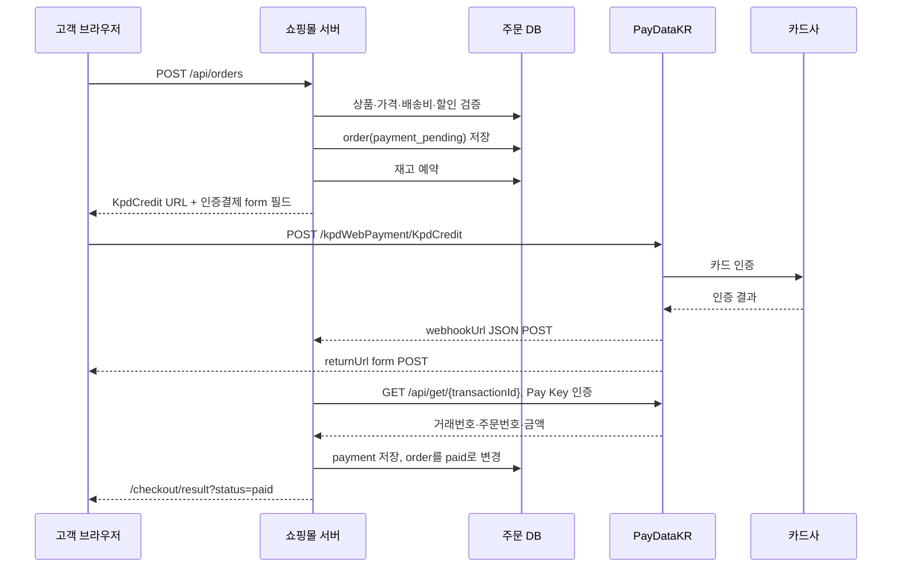

# 한국결제데이터 인증결제 연동 정리

이 문서는 한국결제데이터(PayDataKR)의 카드 인증결제를 다른 프로젝트에 재사용하기 위한 구현 기준이다. 현재 딜키 고객몰에서 실제 한국결제데이터 결제창과 신한카드 인증 화면까지 확인한 방식을 기준으로 작성했다.

문서의 예제에는 실제 Pay Key, Supabase 키, 계정 비밀번호, 테스트 카드번호를 넣지 않는다. 모든 프로젝트에서 환경변수 또는 배포 플랫폼의 Secret으로 주입한다.

## 1. 현재 채택한 방식

| 항목 | 값 |
| --- | --- |
| 결제 종류 | 인증결제 / 신용카드 |
| PG 기본 URL | `https://api.paydatakr.com` |
| 결제창 endpoint | `POST /kpdWebPayment/KpdCredit` |
| 전송 방식 | 브라우저 HTML form POST |
| 권장 화면 방식 | `popuptype=submit` — 현재 창에서 진행 |
| 결제 결과 | `returnUrl` form POST + `webhookUrl` JSON POST |
| 취소 결과 | `cnclreturnUrl` API route로 GET/POST 수신 후 303 redirect |
| 서버 인증 | 조회·환불 API에 `Authorization: {PAYDATAKR_PAY_KEY}` |
| 브라우저에 허용되는 키 | `publicKey`만 허용 |

최종 구현은 브라우저에서 PG JavaScript SDK를 실행하거나 `/api/widget` 일회성 토큰 URL을 사용하는 대신, 공식 인증결제 필드를 직접 form POST한다. 토큰 방식에서는 토큰이 만료되거나 유효하지 않을 때 PG가 결과 URL을 빈 값으로 만든 뒤 `결과전송할 URL이 없습니다`를 표시할 수 있다.

## 2. 전체 흐름



`returnUrl`과 `webhookUrl`은 둘 다 받을 수 있어야 한다. 어느 쪽이 먼저 도착할지 가정하지 말고, 두 경로가 같은 주문 확정 함수를 호출하도록 만든다.

## 3. 필요한 환경변수

```dotenv
# 공개키. 브라우저 form에도 들어갈 수 있지만 소스에 하드코딩하지 않는다.
PAYDATAKR_PUBLIC_KEY=pk_xxxxxxxxxxxxxxxxx

# 서버 전용. /api/get, /api/refund의 Authorization 헤더에만 사용한다.
PAYDATAKR_PAY_KEY=xxxxxxxxxxxxxxxxx

# 선택값. 비워두면 https://api.paydatakr.com 사용
PAYDATAKR_API_BASE_URL=https://api.paydatakr.com

# 결과·통지 URL을 만들 때 사용하는 쇼핑몰 절대 URL
NEXT_PUBLIC_WEB_URL=https://your-shop.example.com
```

Supabase를 사용하는 쇼핑몰이라면 결제 환경변수 외에 다음 서버 환경변수도 필요하다.

```dotenv
NEXT_PUBLIC_SUPABASE_URL=https://xxxxx.supabase.co
NEXT_PUBLIC_SUPABASE_PUBLISHABLE_KEY=sb_publishable_xxxxx
SUPABASE_SERVICE_ROLE_KEY=server-only-secret
```

운영에서 `NEXT_PUBLIC_WEB_URL`은 반드시 HTTPS 절대 URL이어야 한다. 결제사가 이 주소로 결과를 POST하므로 `http://localhost`나 잘못된 preview URL을 넣으면 결과 화면으로 돌아오지 않는다.

다음 값은 브라우저 변수로 만들면 안 된다.

- `PAYDATAKR_PAY_KEY`
- `SUPABASE_SERVICE_ROLE_KEY`
- 주소 검색 API 키 등 서버 전용 키

## 4. 인증결제 form 필드

결제창으로 보낼 기본 action은 다음과 같다.

```text
https://api.paydatakr.com/kpdWebPayment/KpdCredit
```

### 필수 필드

| 필드 | 예시 | 설명 |
| --- | --- | --- |
| `publicKey` | `pk_xxx` | 한국결제데이터가 발급한 공개키 |
| `certflag` | `cardcert` | 카드 인증결제 고정값 |
| `popuptype` | `submit` | `popup`, `layerpopup`, `submit` 중 선택. 현재 창 방식은 `submit` |
| `paysvctype` | `0000` | 일반결제 고정값 |
| `paymethod` | `card` | 신용카드 고정값 |
| `parentTargetNm` | `paymentParent` | 결제 결과 창의 부모 target 이름. 문서상 필수 |
| `amount` | `1000` | 결제 금액. 원 단위 정수 |
| `Unit` | `00` | 원화 고정값 |
| `trackId` | `ORDER-20260909-001` | 가맹점 주문번호. 결과 매칭의 기준 |
| `payerName` | `홍길동` | 구매자명 |
| `goods_name` | `테스트 상품` | 대표 상품명 |
| `HalbuInfo` | `00` | 일시불 고정값 |
| `selcard` | 빈 문자열 | 카드 미리 선택 시 카드 코드, 일반적으로 빈 값 |
| `webhookUrl` | `https://.../webhook` | JSON 결과 통지 API |
| `returnUrl` | `https://.../return` | 브라우저 결과 form POST API |
| `cnclreturnUrl` | `https://.../cancel` | 취소·중지 결과 API |

### 선택 필드

| 필드 | 설명 |
| --- | --- |
| `payerEmail` | 구매자 이메일 |
| `payerTel` | 구매자 연락처. 숫자만 정규화해 전송 |
| `goods_price` | 대표 상품 단가 또는 표시용 금액 |
| `goods_qty` | 대표 상품 수량 |
| `goods_desc` | 상품 설명 |
| `udf1` | 가맹점 여유 필드. 결과에도 돌아오는 값 |

`amount`는 서버에서 계산한 최종 결제금액을 사용한다. 브라우저가 보낸 단가·할인·배송비를 그대로 믿으면 안 된다.

`tmnId`, `mchtId`, `trxId` 같은 값은 공개키와 PG 처리 과정에서 결제사 페이지가 채우는 값이다. 다른 문서나 응답에서 보였다고 브라우저에서 임의로 하드코딩하지 않는다.

## 5. 재사용 가능한 결제 어댑터

프로젝트마다 상품·회원·주문 DB는 다르므로 PG 고유 코드는 어댑터로 격리한다. 아래 코드는 핵심 형태만 보여주는 예제다.

```ts
type PayDataKrFormParams = {
  publicKey: string;
  certflag: 'cardcert';
  popuptype: 'popup' | 'layerpopup' | 'submit';
  paysvctype: '0000';
  paymethod: 'card';
  parentTargetNm: string;
  amount: number;
  Unit: '00';
  trackId: string;
  payerName: string;
  payerEmail?: string;
  payerTel?: string;
  goods_name: string;
  goods_price?: number;
  goods_qty?: number;
  goods_desc?: string;
  HalbuInfo: string;
  selcard: string;
  webhookUrl: string;
  returnUrl: string;
  cnclreturnUrl: string;
};

function buildPayDataKrForm(input: {
  publicKey: string;
  amount: number;
  trackId: string;
  productName: string;
  payerName: string;
  payerTel?: string;
  returnUrl: string;
  webhookUrl: string;
  cancelUrl: string;
}): PayDataKrFormParams {
  if (!Number.isSafeInteger(input.amount) || input.amount <= 0) {
    throw new Error('결제금액이 올바르지 않습니다.');
  }

  return {
    publicKey: input.publicKey,
    certflag: 'cardcert',
    popuptype: 'submit',
    paysvctype: '0000',
    paymethod: 'card',
    parentTargetNm: 'paymentParent',
    amount: input.amount,
    Unit: '00',
    trackId: input.trackId,
    payerName: input.payerName,
    payerTel: input.payerTel?.replace(/\D/g, '').slice(0, 20),
    goods_name: input.productName.slice(0, 40),
    HalbuInfo: '00',
    selcard: '',
    webhookUrl: input.webhookUrl,
    returnUrl: input.returnUrl,
    cnclreturnUrl: input.cancelUrl,
  };
}
```

서버 응답에는 아래처럼 결제 action과 공개 form 필드만 포함한다.

```ts
return Response.json({
  orderId,
  orderNumber,
  amount: totals.paidAmount,
  checkoutUrl: `${apiBaseUrl}/kpdWebPayment/KpdCredit`,
  checkoutParams: buildPayDataKrForm({
    publicKey: process.env.PAYDATAKR_PUBLIC_KEY!,
    amount: totals.paidAmount,
    trackId: orderNumber,
    productName: displayProductName,
    payerName,
    payerTel,
    returnUrl: `${webUrl}/api/payments/paydatakr/return`,
    webhookUrl: `${webUrl}/api/payments/paydatakr/webhook`,
    cancelUrl: `${webUrl}/api/payments/paydatakr/cancel`,
  }),
});
```

`PAYDATAKR_PAY_KEY`는 이 응답이나 HTML에 절대 들어가면 안 된다.

## 6. 브라우저 form 제출

PG 결제창은 `fetch`나 XHR 대신 form POST로 연다. cross-origin form POST는 브라우저가 지원하고, PG가 카드 인증 후 `returnUrl`로 다시 form POST할 수 있다.

```ts
function postPayDataKrForm(
  action: string,
  params: Record<string, string | number | undefined>,
) {
  const form = document.createElement('form');
  form.method = 'POST';
  form.action = action;
  form.target = '_self';
  form.acceptCharset = 'UTF-8';

  for (const [name, value] of Object.entries(params)) {
    if (value === undefined) continue;
    const field = document.createElement('input');
    field.type = 'hidden';
    field.name = name;
    field.value = String(value);
    form.appendChild(field);
  }

  document.body.appendChild(form);
  form.submit();
}
```

주문 API가 성공한 뒤 다음처럼 호출한다.

```ts
postPayDataKrForm(result.checkoutUrl, result.checkoutParams);
```

결제 결과를 부모창으로 돌려보내야 하는 별도 popup 설계를 사용할 때는 `window.name`과 `parentTargetNm`을 정확히 맞춰야 한다. 구현 복잡도와 팝업 차단 문제를 줄이려면 현재 방식처럼 `popuptype=submit`과 `target=_self`를 권장한다.

## 7. 주문 생성 순서

결제창을 열기 전에 서버가 주문을 먼저 만든다. 이 단계에서 고객 브라우저의 가격을 신뢰하지 않는다.

```text
1. 세션 확인
2. 상품·옵션·판매상태·재고를 DB에서 조회
3. 회원가격, 추천인, 프로모션, 배송비를 서버에서 계산
4. order 저장: status = payment_pending
5. order_items 저장
6. 재고 예약
7. 인증결제 form 필드 생성
8. checkoutUrl + checkoutParams 반환
9. 카드 인증 완료 후 결과 callback에서 주문 확정
```

상품 또는 재고 검증이 실패하면 결제창을 만들지 않는다. form 생성이나 서버 처리 중 예외가 나면 예약 재고를 풀고 `payment_pending` 주문을 취소한다.

결제 전 주문을 먼저 저장하는 이유는 동시 구매에서 재고를 확보하기 위해서다. 반대로 결제창을 열고 고객이 그냥 닫았을 때를 대비해 `payment_pending` 주문에 만료 정리 작업을 둔다. 딜키는 20분이 지난 대기 주문을 5분 주기로 찾아 재고를 되돌린다.

## 8. 결과 callback API

PG의 `returnUrl`, `webhookUrl`, `cnclreturnUrl`에는 쇼핑몰 페이지 URL을 직접 넣지 않는다. 브라우저 페이지로 cross-origin POST하면 Next.js Server Actions 요청으로 오인되어 `Invalid Server Actions request` 500이 발생할 수 있다. 항상 API route를 넣고, API route가 결과 페이지로 303 redirect한다.

### 8.1 returnUrl

`returnUrl`은 결제 성공·실패 결과를 UTF-8 form POST로 받는다. 구현은 JSON 요청도 받을 수 있게 만들어 두면 운영 점검에 편리하다.

```ts
export async function POST(request: Request) {
  const contentType = request.headers.get('content-type') ?? '';
  const raw = contentType.includes('application/json')
    ? await request.json()
    : Object.fromEntries((await request.formData()).entries());

  const result = normalizePayDataKrResult(raw);
  const code = payDataKrResultCode(result);

  if (isCancellation(code)) {
    return redirect('/checkout/result?status=cancelled');
  }
  if (code !== '0000') {
    return redirect(`/checkout/result?status=failed&code=${encodeURIComponent(code)}`);
  }

  const finalized = await finalizeOrderFromPayDataKr(result, 'return');
  return redirect(`/checkout/result?status=paid&orderNumber=${encodeURIComponent(finalized.orderNumber)}`);
}
```

성공 결과에는 최소한 `trackId`, 거래번호(`transactionId` 또는 `trxId`), 금액, 결과코드가 있어야 한다. 값이 없으면 주문을 paid로 만들지 않는다.

### 8.2 webhookUrl

`webhookUrl`은 PG가 JSON으로 호출하는 서버 API다. 이 경로에서는 브라우저 redirect를 하지 않고 PG가 요구하는 acknowledgement를 반환한다.

```ts
export async function POST(request: Request) {
  try {
    const body = await request.json();
    const result = normalizePayDataKrResult(body);
    const code = payDataKrResultCode(result);

    if (code === '0000') {
      await finalizeOrderFromPayDataKr(result, 'webhook');
    }

    return new Response('result=0000', { status: 200 });
  } catch (error) {
    console.error('paydatakr webhook failed', error);
    return new Response('result=9999', { status: 500 });
  }
}
```

한국결제데이터 문서에 맞춰 webhook 수신 성공은 `result=0000`으로 응답한다. 승인 실패·취소 통지는 결제 실패로 기록할 수 있지만, 인증되지 않은 실패 통지만으로 재고나 주문을 임의로 변경하지 않는 편이 안전하다. 미완료 `payment_pending` 주문은 만료 작업으로 정리한다.

### 8.3 cnclreturnUrl

취소 URL은 PG가 GET 또는 form POST로 호출할 수 있으므로 둘 다 받는다.

```ts
function redirectCancelled() {
  return Response.redirect(
    'https://your-shop.example.com/checkout/result?status=cancelled',
    303,
  );
}

export const GET = redirectCancelled;
export const POST = redirectCancelled;
```

취소 API에서는 주문 상태나 재고를 직접 변경하지 않는다. 결제가 승인되지 않은 `payment_pending` 주문은 만료 정리나 별도 서버 상태 확인으로 처리한다.

## 9. 결제 확정과 위변조 방지

callback payload는 외부에서 들어오는 값이므로 성공 코드만 보고 결제를 확정하지 않는다. 딜키의 확정 순서는 다음과 같다.

```text
1. resultCode === "0000" 확인
2. trackId로 payment_pending 주문 조회
3. transactionId/trxId 존재 확인
4. Pay Key로 GET /api/get/{transactionId} 재조회
5. 재조회 결과의 trackId, transactionId, amount 검증
6. callback amount와 주문 paid_amount 비교
7. payments에 pending 행 선점
8. payments를 paid로 갱신하고 원문 payload 저장
9. orders.status를 payment_pending → paid로 변경
10. 결제 이후에만 추천 수수료·프로모션 사용량·분석 이벤트 처리
11. 결과 페이지로 이동
```

금액은 다음 세 곳이 모두 일치해야 한다.

```text
PG callback amount
= PayDataKR /api/get 응답 amount
= DB orders.paid_amount
```

`payments.order_id`에 unique 제약을 두면 webhook과 return이 동시에 도착해도 주문당 결제 행을 하나만 만들 수 있다. 중복 통지는 성공으로 덮어쓰지 말고 이미 처리 중인 상태로 응답한다.

결제 원문은 분쟁·대사에 필요할 수 있으므로 DB에 보관한다. 다만 서버 로그에는 Pay Key, 카드번호, 인증값을 기록하지 않는다.

## 10. 거래 조회와 환불

### 거래 조회

```http
GET https://api.paydatakr.com/api/get/{transactionId}
Authorization: {PAYDATAKR_PAY_KEY}
Accept: application/json
```

거래 조회 결과가 `0000`이어도 주문번호·거래번호·금액을 함께 확인해야 한다.

### 결제 취소

```http
POST https://api.paydatakr.com/api/refund
Authorization: {PAYDATAKR_PAY_KEY}
Content-Type: application/json
```

```json
{
  "refund": {
    "trxType": "ONTR",
    "trackId": "CANCEL-ORDER-001",
    "amount": 1000,
    "rootTrxId": "원거래 거래번호",
    "rootTrackId": "원거래 가맹점 주문번호",
    "rootTrxDay": "20260909",
    "webhookUrl": "https://your-shop.example.com/api/payments/paydatakr/webhook"
  },
  "metadata": {}
}
```

취소에는 원거래 `rootTrxId`, `rootTrackId`, `rootTrxDay`가 필수다. 승인 취소는 원거래와 같은 금액이어야 하고, 매입 취소는 원거래 이하 금액을 사용할 수 있다. 환불 API가 성공 응답을 준 뒤에만 DB의 payment·order 상태를 변경한다.

## 11. 오류별 점검

### `결과전송할 URL이 없습니다`

PG 결과 페이지의 `returnurl` 변수가 비어 있을 때 표시된다. 다음을 확인한다.

- `returnUrl`이 form hidden input에 실제로 들어갔는지
- URL이 `https://` 절대 URL인지
- 결제 action이 올바른 `KpdCredit`인지
- 만료·유효하지 않은 위젯 token을 사용하고 있지 않은지
- PG에 전달한 callback URL이 페이지가 아닌 API route인지

현재 인증결제 form 방식은 token을 사용하지 않아 이 오류를 피한다.

### `서버와 통신할 수 없습니다`

브라우저가 PG iframe·카드사 인증 화면을 불러오지 못했을 때의 메시지다. 운영 도메인 HTTPS, 브라우저 팝업·추적 방지 설정, PG/카드사 도메인 접근을 확인한다. 서버 주문 API가 성공했는지는 PG 화면이 아니라 운영 로그에서 확인한다.

### `Invalid Server Actions request` 또는 `/checkout` 500

`returnUrl` 또는 취소 URL을 `/checkout` 같은 Next.js 페이지로 직접 지정한 경우가 대표 원인이다. `/api/payments/paydatakr/return`과 `/api/payments/paydatakr/cancel` 같은 route handler가 form POST를 받고 303 redirect하도록 바꾼다.

### 결제창은 열리지만 고객몰에 주문이 paid로 안 됨

다음 로그를 request ID로 연결한다.

```text
[cc:event] web.orders.create       stage=start
[cc:event] order.prepare           stage=ready
[cc:event] payment.paydatakr.webhook stage=received
[cc:event] payment.paydatakr.return  stage=received
[cc:event] order.finalize          stage=paid
```

`order.finalize`의 조회 단계에서 멈추면 Pay Key, 거래번호, amount 매칭을 확인한다. callback 성공 코드만 있고 `/api/get` 조회가 일치하지 않으면 paid로 만들지 않는 것이 정상이다.

### 로컬에서 결제창이 열리지 않음

Supabase와 PayDataKR 환경변수가 없는 로컬 데모 모드는 실제 주문·결제를 차단해야 한다. 실제 테스트는 운영 URL에서 하거나, 테스트 전용 Supabase와 PayDataKR 변수를 로컬에 넣는다. 데모 주문을 실제 결제 성공처럼 반환하면 결제창이 없는 원인을 찾기 어렵고 가짜 성공으로 오해할 수 있다.

## 12. 다른 프로젝트에 옮길 때의 체크리스트

### PG 연결

- [ ] PayDataKR 인증결제 가맹점 정보와 카드 테스트 조건 확인
- [ ] `PAYDATAKR_PUBLIC_KEY`를 해당 환경에 등록
- [ ] `PAYDATAKR_PAY_KEY`를 서버 Secret으로 등록
- [ ] `NEXT_PUBLIC_WEB_URL`을 실제 HTTPS 도메인으로 등록
- [ ] `returnUrl`, `webhookUrl`, `cnclreturnUrl`이 외부에서 접근 가능한지 확인
- [ ] 서버·클라이언트에 Pay Key가 번들되지 않는지 검색

### 주문·DB

- [ ] 서버가 최종 금액을 계산하는지 확인
- [ ] `payment_pending` 주문과 재고 예약을 먼저 저장하는지 확인
- [ ] PG form 생성 실패 시 재고·주문 rollback이 있는지 확인
- [ ] `payments.order_id` unique 제약 또는 동등한 멱등성 장치 추가
- [ ] `trackId`가 주문과 PG callback에서 유일한지 확인
- [ ] callback 성공 후 `/api/get` 재조회 및 주문번호·거래번호·금액 검증
- [ ] 대기 주문 만료 정리 작업 추가

### 브라우저

- [ ] `KpdCredit`에 HTML form POST하는지 확인
- [ ] `form.acceptCharset = 'UTF-8'` 설정
- [ ] `popuptype=submit`, `form.target='_self'` 조합 확인
- [ ] PG callback URL을 페이지에 직접 지정하지 않고 API route로 지정
- [ ] 결제 버튼 중복 클릭 방지
- [ ] 카드정보·비밀번호·Pay Key를 쇼핑몰 서버가 수집하지 않는지 확인

### 운영 검증

- [ ] 테스트 금액으로 결제창이 열림
- [ ] 약관 동의 후 카드사 인증 화면까지 이동
- [ ] 사용자 취소 시 `status=cancelled` 결과 화면으로 이동
- [ ] 테스트 승인 후 `returnUrl`과 `webhookUrl` 로그 확인
- [ ] 주문 상태가 `payment_pending → paid`로 변경됨
- [ ] 주문 금액과 결제 금액이 일치함
- [ ] 주문 조회에서 결제 내역이 보임
- [ ] 관리자에서 전액 환불 후 payment/order 상태가 맞게 변경됨
- [ ] 환불 후 재고와 수수료 상태를 확인함

## 13. 딜키 구현 파일 매핑

다른 프로젝트에서는 아래 역할만 가져가고, 상품·회원·주문 모델은 해당 프로젝트에 맞게 교체한다.

| 역할 | 딜키 파일 |
| --- | --- |
| PG 필드 생성·금액/URL 검증·조회·환불 | `packages/payment/src/paydatakr.ts` |
| 키와 절대 URL 환경변수 | `apps/web/lib/paydatakr-config.ts` |
| 주문 계산·저장·재고 예약·rollback·paid 확정 | `apps/web/lib/order-service.ts` |
| 고객 form POST | `apps/web/components/checkout-form.tsx` |
| 주문 시작 API | `apps/web/app/api/orders/route.ts` |
| 브라우저 결과 수신 | `apps/web/app/api/payments/paydatakr/return/route.ts` |
| JSON webhook 수신 | `apps/web/app/api/payments/paydatakr/webhook/route.ts` |
| 취소 GET/POST 수신 | `apps/web/app/api/payments/paydatakr/cancel/route.ts` |
| 결제 결과 화면 | `apps/web/app/checkout/result/page.tsx` |
| 대기 주문 만료·재고 회수 | `supabase/migrations/20260901040000_expire_stale_pending_orders.sql` |

공통 어댑터를 만들 때는 PG 코드를 UI에 직접 넣지 않고 다음 계약으로 감싼다.

```ts
interface PaymentAdapter {
  prepareCheckout(input: PrepareCheckoutInput): Promise<{
    action: string;
    fields: Record<string, string | number>;
  }>;
  handleReturn(request: Request): Promise<PaymentResult>;
  handleWebhook(request: Request): Promise<void>;
  lookup(transactionId: string): Promise<LookupResult>;
  refund(input: RefundInput): Promise<RefundResult>;
}
```

이 계약을 사용하면 다음 프로젝트에서 Stripe, 토스, 다른 PG로 바꿀 때 주문 서비스와 화면을 크게 바꾸지 않고 어댑터만 교체할 수 있다.

## 14. 공식 문서

- [한국결제데이터 인증결제 문서](https://www.paydatakr.com/manual/kpayd-cert-pay-docs-v1.0.html)
- [한국결제데이터 Pay API 문서](https://www.paydatakr.com/manual/kpayd-pay-api-docs-v1.5.html)
- [한국결제데이터 매뉴얼 목록](https://www.paydatakr.com/manual/)

문서 버전이나 필드가 바뀔 수 있으므로 새 프로젝트를 연결할 때는 위 공식 문서와 가맹점에 전달받은 운영 조건을 다시 대조한다.

## 15. 딜키에서 확인한 범위

2026-09-09 기준으로 다음을 확인했다.

- `/kpdWebPayment/KpdCredit` form POST 후 한국결제데이터 결제 화면 표시
- 약관 동의 후 신한카드 온라인 인증 화면 진입
- 인증 화면에서 취소 후 `https://dealkey.co.kr/checkout/result?status=cancelled` 이동
- 운영 주문 API가 로그인 없는 요청에 `401`을 반환해 Supabase 운영 경로로 진입
- 결제 관련 테스트 31개, 전체 lint·typecheck·test·build 44개 성공

실제 테스트 카드 승인과 승인 후 주문 확정은 2026-09-09 딜키 운영환경에서 확인했다. 전액 환불은 카드정보와 가맹점 운영 조건이 필요한 별도 검증 단계로 아직 실행하지 않았다.
